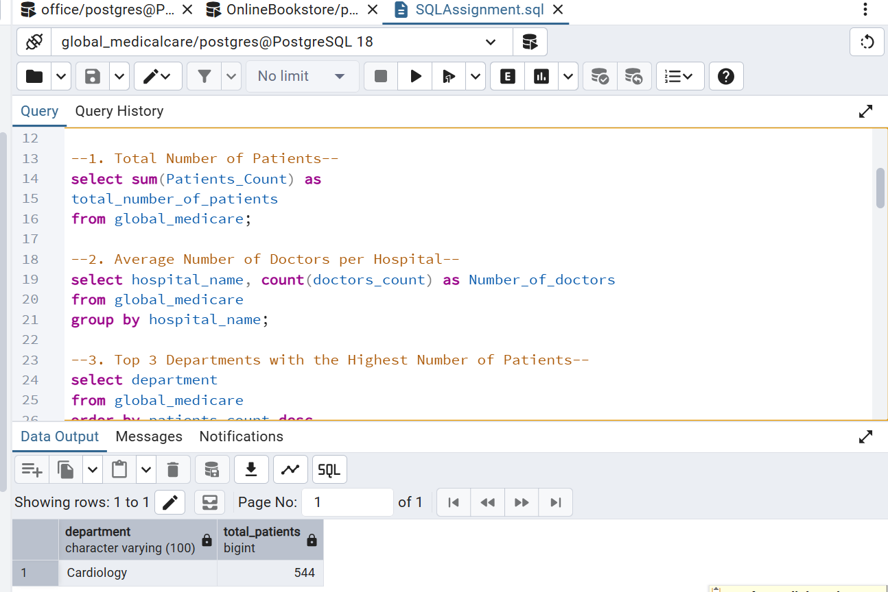
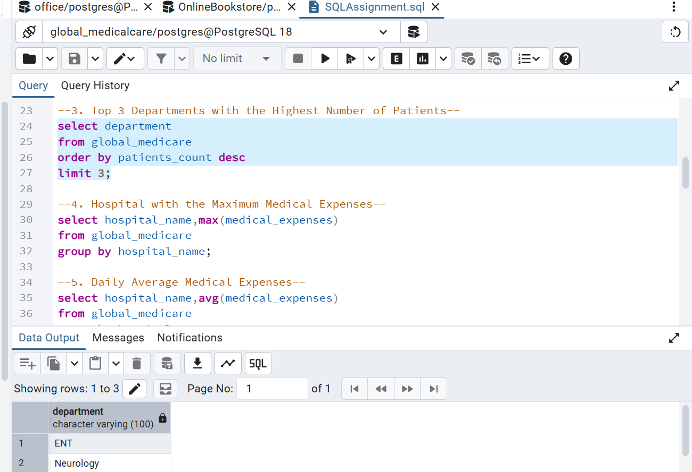
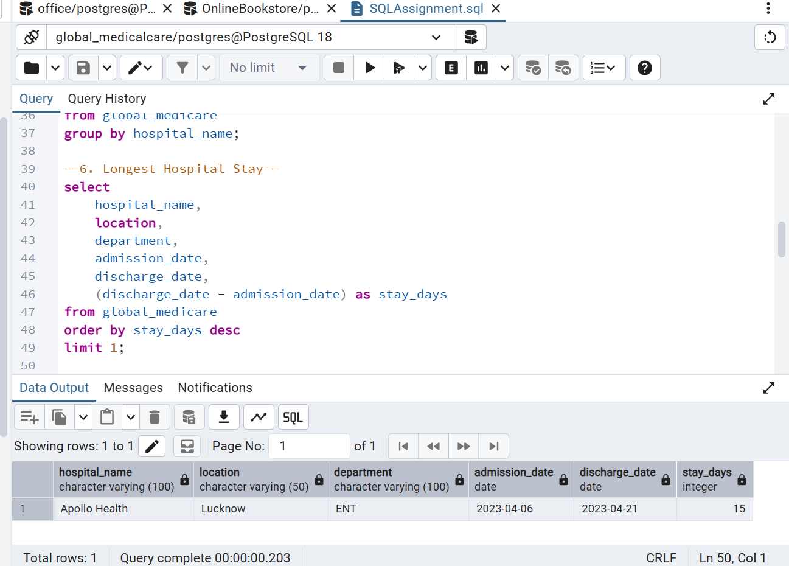

# Global Medicare SQL Analysis

## 📌 Project Overview

This project focuses on analyzing hospital and patient data using SQL in PostgreSQL.

The objective was to extract meaningful insights from healthcare data by applying SQL queries for aggregation, ranking, grouping, and date-based analysis.

## 🛠️ Tools & Technologies

- PostgreSQL
- pgAdmin 4
- SQL

## 📊 Analysis Performed

The project answers key healthcare-related business questions, including:

1. Total number of patients
2. Number of doctors by hospital
3. Top 3 departments with the highest number of patients
4. Hospital with the maximum medical expenses
5. Average medical expenses by hospital
6. Hospital with the longest patient stay

## 🔍 SQL Concepts Used

- SELECT
- WHERE
- ORDER BY
- GROUP BY
- Aggregate Functions
- SUM()
- AVG()
- COUNT()
- MAX()
- LIMIT
- Date arithmetic
- Column aliases

## 📸 Query Results

### Total Number of Patients

### Top 3 Departments by Patients

### Longest Hospital Stay

## 💡 Key Learning Outcomes

Through this project, I strengthened my ability to:

- Analyze structured healthcare data using SQL
- Write queries to answer real-world analytical questions
- Use aggregate functions for data summarization
- Group and rank data to identify important insights
- Perform date-based calculations
- Present query results in a clear and structured format

## 📁 Repository Contents

- `global_medicare_sql_analysis.sql` — SQL queries used for the analysis
- `01_total_patients.png` — Query result screenshot
- `03_top_departments.png` — Query result screenshot
- `06_longest_hospital_stay.png` — Query result screenshot

## 🚀 Conclusion

This project demonstrates practical SQL skills through a healthcare data analysis use case, with a focus on transforming raw data into meaningful insights using PostgreSQL.

---

**Author:** Bulbul Raghav  
**Focus:** Data Analytics | SQL | PostgreSQL | Data Insights
